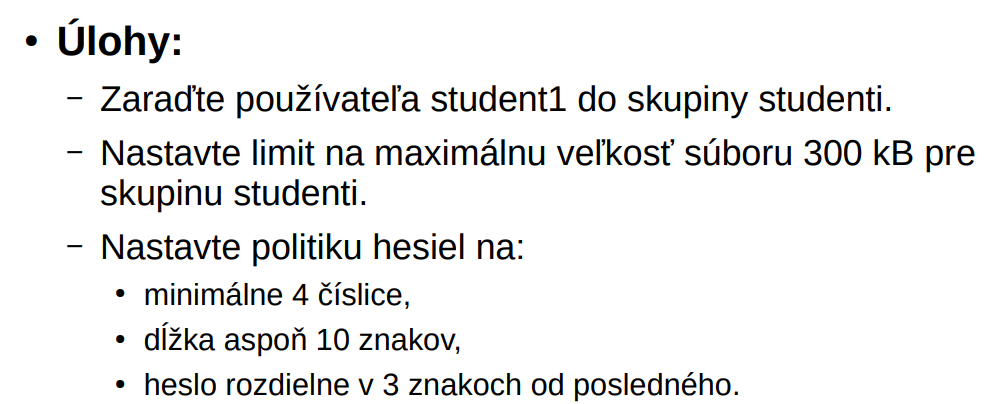
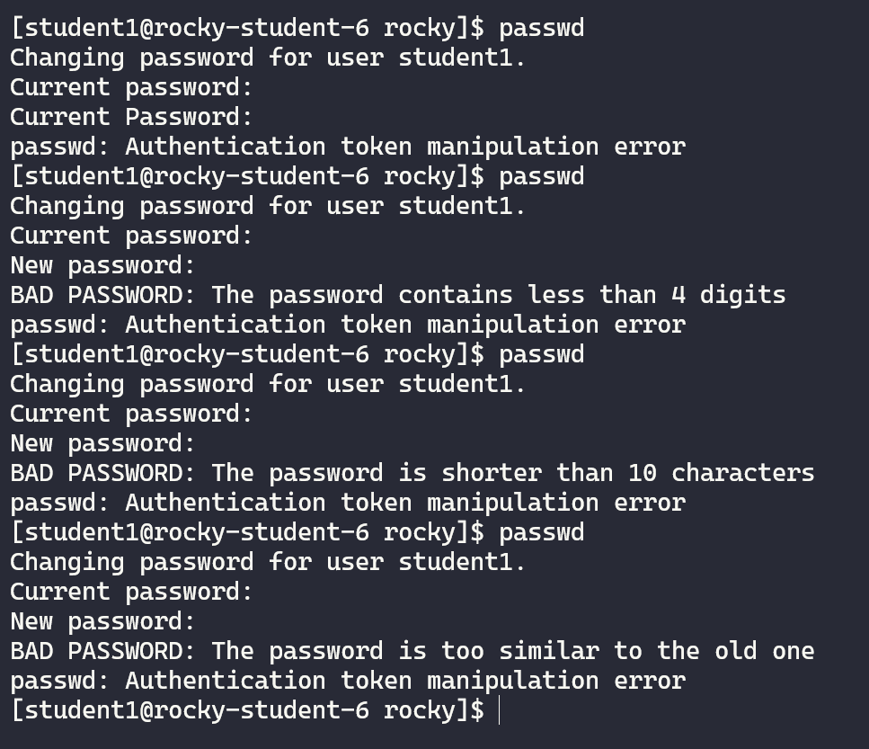

# PRBIT - Princípy bezpečnosti informačných technológií
## Report - Domáca úloha č.1
#### Autor: Marek Čederle
#### Cvičenie: Pondelok 17:00


### Použité príkazy a ich vysvetlenie
#### Zadanie č.1


```bash
sudo groupadd wheel users groups
sudo useradd --groups users,groups student1
sudo useradd --groups users,groups student2
sudo useradd --group wheel admin
sudo chage --maxdays 90 admin
```
- `groupadd` - príkaz na vytvorenie skupiny (parametre su názvy skupín)
- `useradd` - príkaz na vytvorenie používateľa
    - `--groups` - prepínač, ktorý pridá používateľa do skupín (parametre sú názvy skupín, syntax je dôležitý a treba nemať medzery)
    - `student1` - názov používateľa
- `chage` - príkaz na zmenu nastavení používateľského účtu a vypršania jeho hesla
    - `--maxdays` - prepínač, ktorý nastavuje maximálny počet dní, po ktorých vyprší heslo (s parametrom `90` - počet dní)
    - `admin` - názov používateľa

Treba vytvoriť hociaký súbor v `/etc/profile.d`, môj má názov `welcome_message.sh`:
```bash
sudo nano /etc/profile.d/welcome_message.sh
```
Následne do neho pridať tento kód a uložiť ho:
```bash
#! /bin/bash
echo "Ahoj \`$(whoami)\`"
```
- `#! /bin/bash` - shebang, ktorý hovorí, že sa jedná o bash skript
- `echo` - príkaz na výpis textu
- `$(whoami)` - príkaz, ktorý vráti názov používateľa, ktorý je prihlásený

Testovanie výpisu správy pri prihlásení:


Spustenie bezpečného editora pre súbor `/etc/sudoers`:
```bash
sudo visudo
```

Treba pridať do súboru `/etc/sudoers` (optimálne na koniec) nasledovný riadok:
```bash
admin   ALL=(ALL)   NOPASSWD: /bin/su
```
- `admin` - názov používateľa
- `ALL` - platí to pre všetkých hostov
- `NOPASSWD` - znamená, že sa nemusí zadávať heslo pri príkaze `su`

Testovanie použitia príkazu `su` bez hesla na používateľovi `admin`:


#### Zadanie č.2



Keďže používateľ `student1` už bol vytvorený, tak ho treba iba modifikovať, načo slúži príkaz `usermod`.
```bash
sudo usermod -aG studenti student1
```
- `-a` - (append) pridá používateľa do skupiny (nemažú sa ostatné skupiny)
- `-G` - (group) hovorí o tom že sa ide používateľ pridať do skupiny
- `studenti` - skupina do ktorej sa pridáva používateľ
- `student1` - používateľ, ktorý sa pridáva do skupiny

Na koniec súboru `/etc/security/limits.conf` treba pridať riadok:
```bash
@studenti   hard    fsize   300
```
- `@studenti` - @ je použitý pre označenie skupiny (studenti je názov skupiny)
- `hard` - nastavuje hard limit (nemôže ho používateľ zmeniť ani prekročiť)
- `fsize` - parameter ktorý hovorí o limite na veľkosť súboru
- `300` - veľkosť súboru v kB (kilo-bytoch)

Testovanie veľkosti súboru:


Do súboru `/etc/security/pwquality.conf` treba pridať riadky:
```bash
difok = 3
minlen = 10
dcredit = -4
```
- `difok` - počet znakov, ktoré sa musia líšiť od predchádzajúceho hesla
- `minlen` - minimálna dĺžka hesla
- `dcredit` - minimálny počet číslic v hesle (mínus značí že ide o minimálny počet, bez znamienka by to bolo maximálny počet)

Testovanie zmeny hesla:
