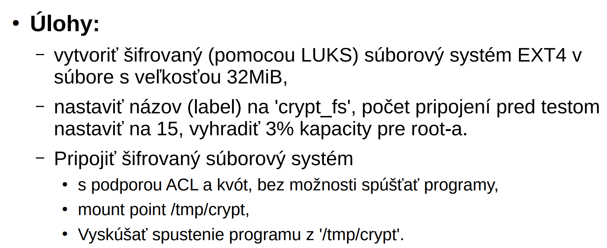
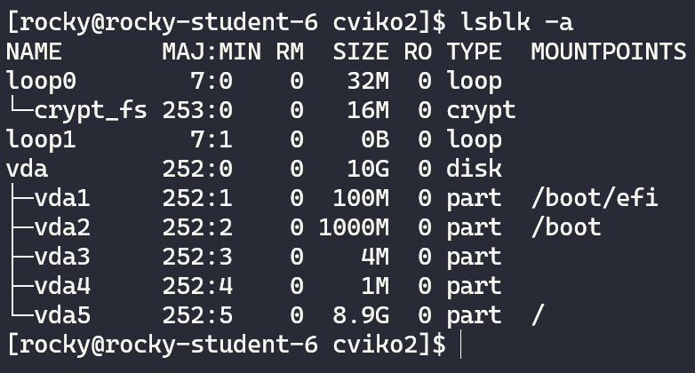
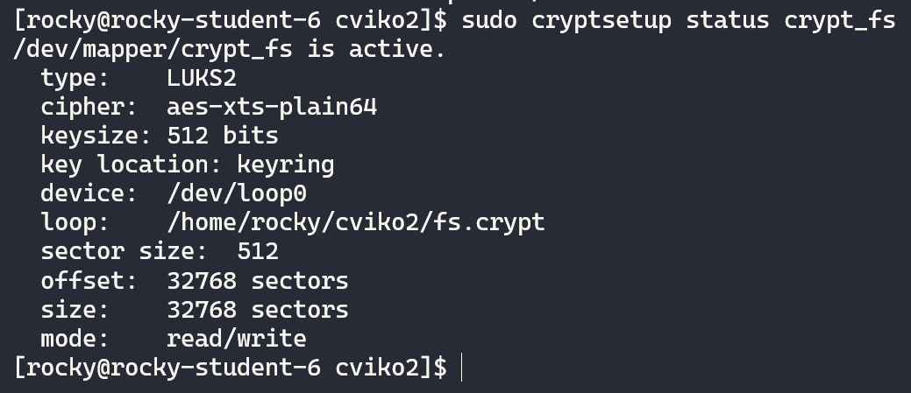
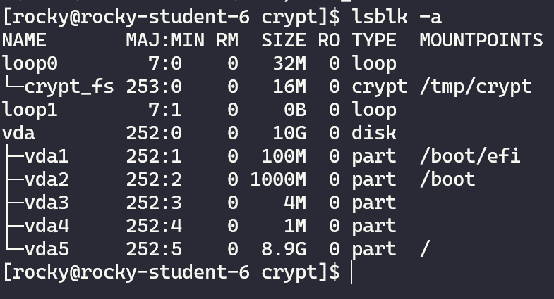
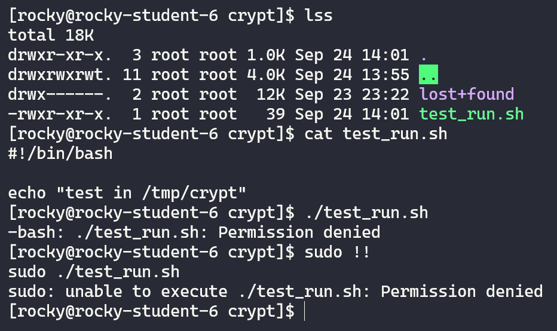
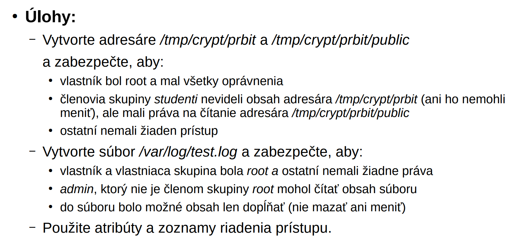
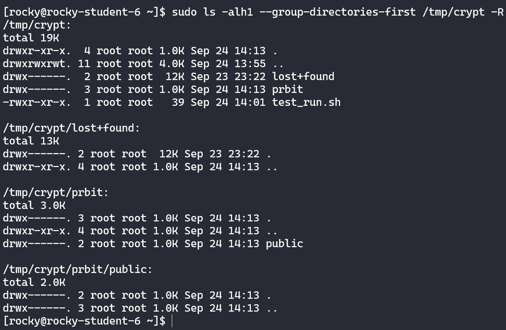
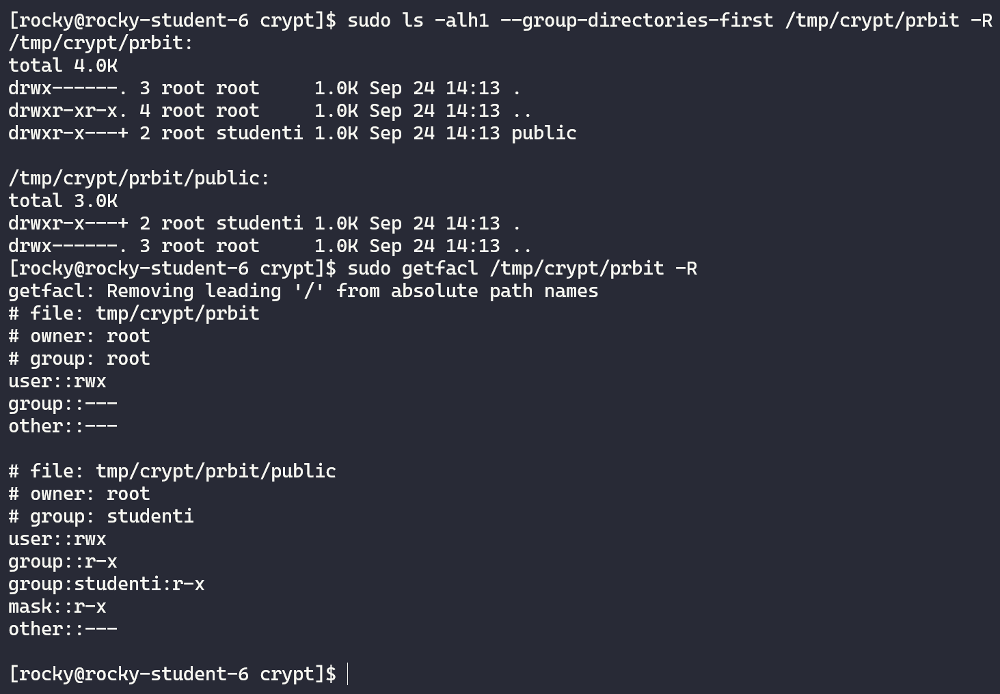
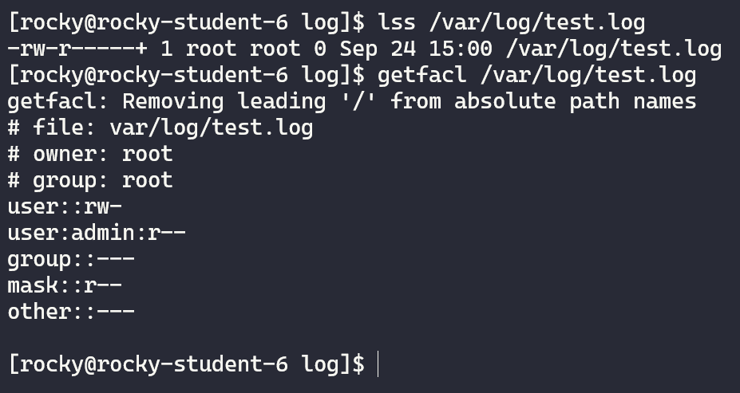

# PRBIT - Princípy bezpečnosti informačných technológií
## Report - Domáca úloha č.2
#### Autor: Marek Čederle
#### Cvičenie: Pondelok 17:00


### Použité príkazy a ich vysvetlenie
#### Zadanie č.1


Najskôr som si vytvoril testovací priečinok `cviko2` a tam som pokračoval so zadaním.
```bash
mkdir ~/cviko2
cd ~/cviko2
dd if=/dev/zero of=fs.crypt bs=1M count=32
```
- `dd` - príkaz na konvertovanie a kopírovanie súborov
    - `if` - prepínač, ktorý určuje vstupný súbor
    - `/dev/zero` - špeciálny súbor, ktorý obsahuje nuly
    - `of` - prepínač, ktorý určuje výstupný súbor
    - `fs.crypt` - názov súboru, ktorý sa vytvorí
    - `bs` - prepínač, ktorý určuje veľkosť bloku (1M - 1 MiB)
    - `count` - prepínač, ktorý určuje počet blokov (32 - 32 MiB)

Nasledujúci príkaz vytvorí nové loop zariadenie `/dev/loop0` (pretože som na sytéme nemal okrem /dev/loop-control iné loop zariadenie).
```bash
sudo losetup -f
```
- `losetup` - príkaz na zpojazdnenie a konfiguráciu loop zariadení
    - `-f` - prepínač, ktorý nájde a vypíše voľné loop zariadenie (ak žiadne nenájde, tak vytvorí nové)

Pripojenie súboru k loop zariadeniu (stale sa nachádzam v priečinku `~/cviko2`):
```bash
sudo losetup /dev/loop0 fs.crypt
```
- `/dev/loop0` - názov loop zariadenia
- `fs.crypt` - názov súboru, ktorý sa pripojí

Zobrazenie blokových zariadení pomocou príkazu `lsblk -a`:


Vytvorenie šifrovaného (LUKS) súborového systému v subore na `/dev/loop0`:
```bash
sudo cryptsetup luksFormat /dev/loop0 --label "crypt_fs"
```
- `cryptsetup` - príkaz na správu šifrovaných zariadení pomocou LUKS/dm-crypt
    - `luksFormat` - prepínač na naformátovanie zariadenia na LUKS
    - `/dev/loop0` - názov zariadenia, ktoré sa šifruje
    - `--label` - prepínač, ktorý určuje label zariadenia
    - `"crypt_fs"` - label zariadenia

```bash
sudo cryptsetup open /dev/loop0 crypt_fs
```
- `open` - prepínač na "otvorenie" šifrovaného zariadenia (namapuje ho na `/dev/mapper/crypt_fs`)

Vytvorenie `ext4` súborového systému v šifrovanej časti:
```bash
sudo mkfs.ext4 -L crypt_fs -m 3 /dev/mapper/crypt_fs
sudo tune2fs -c 15 /dev/mapper/crypt_fs
```
- `mkfs.ext4` - príkaz na vytvorenie súborového systému (v tomto pripade ext4)
    - `-L` - prepínač, ktorý určuje label súborového systému
    - `crypt_fs` - label súborového systému
    - `-m` - prepínač, ktorý určuje percentuálnu rezerváciu kapacity pre super-usera
    - `3` - predstavuje 3% rezerváciu
    - `/dev/mapper/crypt_fs` - názov zariadenia, ktoré sa formátuje
- `tune2fs` - príkaz na nastavenie parametrov súborového systému
    - `-c` - prepínač, ktorý určuje počet pripojení pred testom súborového systému
    - `15` - počet pripojení

Zobrazenie stavu šifrovaného súborového systému pomocou príkazu `cryptsetup status crypt_fs`:



Nasledujúci príkaz vytvorí priečinok `/tmp/crypt` a pripojí do neho šifrovaný súborový systém s povolením ACL, uzívateľských kvót a bez možnosti spustenia súborov:
```bash
sudo mkdir -p /tmp/crypt
sudo mount -o acl,usrquota,noexec /dev/mapper/crypt_fs /tmp/crypt
```
- `mount` - príkaz na pripojenie súborového systému
    - `-o` - prepínač, ktorý určuje možnosti pripojenia (options)
    - `acl` - povolenie ACL
    - `usrquota` - povolenie uzívateľských kvót
    - `noexec` - zakáže spustenie súborov
    - `/dev/mapper/crypt_fs` - názov zariadenia, ktoré sa pripája
    - `/tmp/crypt` - cesta, kam sa pripája

Zobrazenie pripojených súborových systémov pomocou príkazu `lsblk -a` (pripojený do `/tmp/crypt`):


Na otestovanie spustitelnosti súborov treba pomocou editora vytvorit subor v `/tmp/crypt` a do neho vložiť nasledujúci kód:
```bash
#!/bin/bash

echo "test in /tmp/crypt"
```
Musíme nastaviť prístupové práva, aby bol súbor spustiteľný a následne ho spustiť:
```bash
chmod +x /tmp/crypt/test.sh
/tmp/crypt/test.sh
```
- `chmod` - príkaz na zmenu prístupových práv
    - `+x` - pridá právo na spustenie pre všetkých

Otestovanie spustitelnosti súboru v `/tmp/crypt` (nefunguje ani pomocou `sudo`):



#### Zadanie č.2



Vytvorenie adresára `/tmp/crypt/prbit` a `/tmp/crypt/prbit/public` s prístupovými právami (vlastník je `root` pretože som použil `sudo`):
```bash
sudo mkdir /tmp/crypt/prbit
sudo mkdir /tmp/crypt/prbit/public
sudo chmod 700 /tmp/crypt/prbit
sudo chmod 750 /tmp/crypt/prbit/public
```
- `chmod` - príkaz na zmenu prístupových práv
    - `700` - nastavenie prístupových práv na úplny prístup pre vlastníka a ostatným zakáže prístup
    - `750` - nastavenie prístupových práv na úplny prístup pre vlastníka, čítanie a spustenie pre skupinu a ostatným zakáže prístup

Overenie prístupových práv, že vlastník je `root`:


Nastavenie prístupových práv pre skupinu `studenti` a nastavenie prístupových práv pre ostatných:
```bash
sudo setfacl -m g:studenti:rx /tmp/crypt/prbit/public
sudo setfacl -m g::rx /tmp/crypt/prbit/public
sudo chown :studenti /tmp/crypt/prbit/public
```
- `setfacl` - príkaz na nastavenie prístupových práv (set file access control list)
    - `-m` - prepínač, ktorý určuje, že sa nastavujú nové prístupové práva
    - `g:studenti:rx` - nastavenie prístupových práv pre skupinu `studenti` na čítanie a spustenie (g - group)
    - `g::rx` - nastavenie prístupových práv pre všetky skupiny na čítanie a spustenie
- `chown` - príkaz na zmenu vlastníka a skupiny súboru
    - `:studenti` - nastavenie skupiny na `studenti` súboru `/tmp/crypt/prbit/public`

Overenie prístupových práv:


Vytvorenie súboru `/tmp/crypt/prbit/public/test.txt` pomocou `touch` a nastavenie prístupových práv (vlastník je `root` pretože som použil `sudo`):
```bash
sudo touch /var/log/test.log
sudo chmod 600 /var/log/test.log
sudo setfacl -m u:admin:r /var/log/test.log
sudo chattr +a /var/log/test.log
```
- `chmod 600` - nastavenie prístupových práv na čítanie a zápis iba pre vlastníka
- `setfacl` - príkaz na nastavenie prístupových práv (set file access control list)
    - `u:admin:r` - nastavenie prístupových práv pre používateľa `admin` na čítanie
- `chattr` - príkaz na zmenu atribútov súboru
    - `+a` - pridanie atribútu `append-only` na súbor

Overenie prístupových práv:
