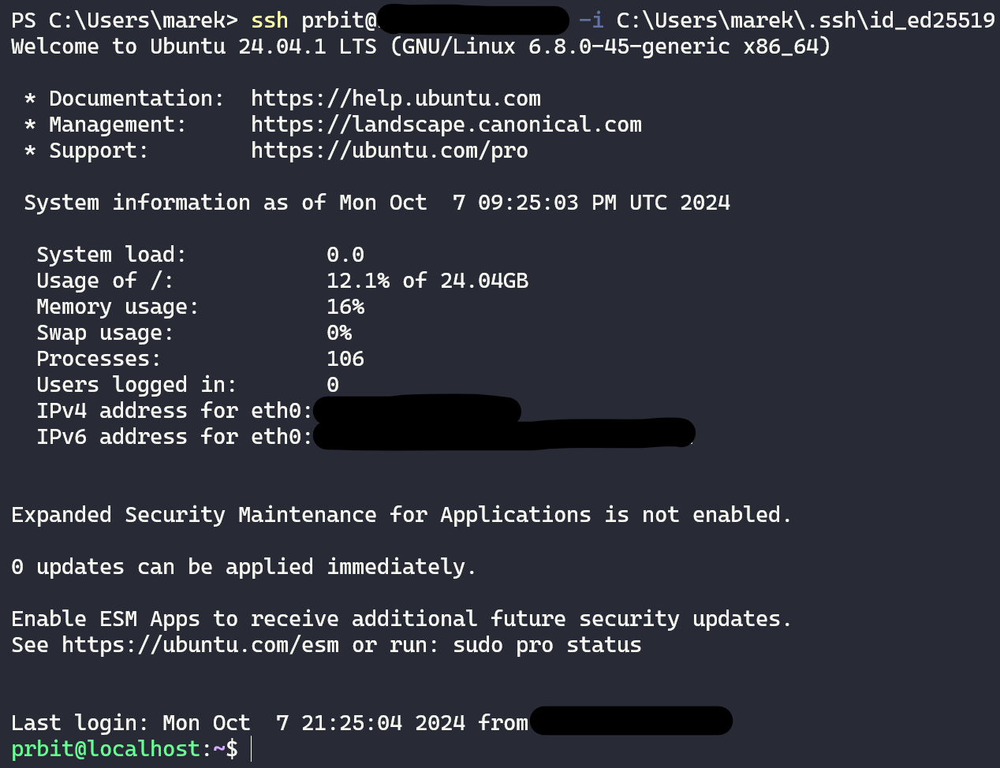

# PRBIT - Princípy bezpečnosti informačných technológií
## Report - Domáca úloha č.4
#### Autor: Marek Čederle
#### Cvičenie: Pondelok 17:00


### Použité príkazy a ich vysvetlenie
#### Zadanie č.1


IP adresu, MAC adresu a informáciu o tom, či používame DHCP zistíme pomocou nasledujúceho príkazu:
```bash
ip addr
```
Identifikujeme rozhranie, ktoré nás zaujíma, v tomto prípade `enp0s3` resp. `eth0`. Zistíme IP adresu, MAC adresu a informáciu o DHCP.
- `inet` - IP adresa aj s prefixom (maskou siete)
    - `dynamic` - IP adresa je pridelená pomocou DHCP
- `link/ether` - MAC adresa


Na zistenie smerovacej tabuľky môžeme použiť jeden z nasledujúcich príkazov:
```bash
route -n
# alebo
ip route
```


Na zistenie DNS serverov si vieme vypísať konfiguračný súbor `/etc/resolv.conf`:
```bash
cat /etc/resolv.conf
```

Dostupnosť sieťových služieb môžeme zistiť pomocou príkazu `ping`, ktorý používa protokol `ICMP`:
```bash
ping -c 4 1.1.1.1
```
- `-c 4` - počet odoslaných paketov (count 4)
- `1.1.1.1` - IP adresa, ktorú chceme pingnúť (v tomto prípade verejný Cloudflare DNS server)

#### Zadanie č.2


Všetky pravidlá vieme nastaviť pomocou príkazu `iptables`.
```bash
# Povolenie existujúcich spojení a súvisiacej komunikácie
sudo iptables -A INPUT -i eth0 -m state --state ESTABLISHED,RELATED -j ACCEPT

# Povolenie prichádzajúcej ICMP komunikácie
sudo iptables -A INPUT -i eth0 -p icmp -j ACCEPT

# Povolenie loopback rozhrania (všade)
sudo iptables -A INPUT -i lo -j ACCEPT
sudo iptables -A OUTPUT -o lo -j ACCEPT
sudo iptables -A FORWARD -i lo -j ACCEPT
sudo iptables -A FORWARD -o lo -j ACCEPT

# Povolenie nových SSH spojení
sudo iptables -A INPUT -i eth0 -p tcp -m state --state NEW -m tcp --dport 22 -j ACCEPT

# Povolenie novej komunikácie z lokálnej siete na známe porty
sudo iptables -A INPUT -i eth0 -p tcp -m state --state NEW -s 10.103.0.0/16 --dport 0:1023 -j ACCEPT
sudo iptables -A INPUT -i eth0 -p udp -m state --state NEW -s 10.103.0.0/16 --dport 0:1023 -j ACCEPT

# Logovanie všetkých prichádzajúcich paketov
sudo iptables -A INPUT -j LOG

# Zakázanie všetkého ostatného, čo nebolo definované vyššie
sudo iptables -P INPUT DROP

# Uloženie nastavení aby sa načítali a aplikovali pravidlá aj po reštarte
service iptables save
```


#### Zadanie č.3


Všetko vyriešime editovaním konfiguračného súboru pre SSH deamona.
```bash
sudo nano /etc/ssh/sshd_config
```
Treba zmeniť nasledujúce hodnoty:

|               Pred            |            Po             |
|-------------------------------|---------------------------|
| PermitRootLogin yes           | PermitRootLogin no        |
| PasswordAuthentication yes    | PasswordAuthentication no |
| X11Forwarding yes             | X11Forwarding no          |


Následne je treba reštartovať SSH deamona, aby sa zmeny prejavili:
```bash
sudo systemctl restart sshd
```


#### Zadanie č.4


Miesto toho aby som použil `student` server, tak som si spravil inštanciu na Linode cloude, kde som si zriadil Ubuntu 24.04 LTS server. A tam som si nastavil autentifikáciu pomocou SSH kľúčov podobne ako v úlohe 3 s tým, že som si vygeneroval kľúč na svojom počítači a následne som ho nahral na server pomocou ich webového rozhrania. Na generovanie a nahratie kľúčov som z časti použil ich oficiálny [návod](https://www.linode.com/docs/guides/use-public-key-authentication-with-ssh/?tabs=ed25519-recommended,manually,ssh-add).
Príkazy použité po pripojený na server ako root (verejný kľúč už je na servery nahraný):
```bash
# Základný setup
sudo apt update && sudo apt upgrade -y
sudo apt update && sudo apt install neofetch net-tools -y
sudo reboot

# Vytvorenie testovacieho používateľa
sudo useradd -m -s /bin/bash --group sudo prbit
sudo usermod -aG sudo prbit
passwd prbit

# Skopírovanie verejného kľúča do adresára používateľa (prihlásený ako root )
mkdir /home/prbit/.ssh
touch /home/prbit/.ssh/authorized_keys
cat ~/.ssh/authorized_keys > /home/prbit/.ssh/authorized_keys

# Editovanie konfiguračného súboru SSH ako v úlohe 3
sudo nano /etc/ssh/sshd_config
```
|               Pred            |            Po             |
|-------------------------------|---------------------------|
| PermitRootLogin yes           | PermitRootLogin no        |
| PasswordAuthentication yes    | PasswordAuthentication no |
| X11Forwarding yes             | X11Forwarding no          |
```bash
# Reštartovanie SSH deamona
sudo systemctl restart ssh
```



#### Finálna otázka


Po zriadení VM je najlepšie čo najskôr zakázať prihlasovanie na roota s tým, že si vygenerujeme kľúč na pripájanie a zakážeme aj pripájanie pomocou hesla. To by malo zaručiť, že iba my ako jediná osoba (resp. každá osoba s daným kľúčom) sa vie pripojiť na server. Následne by sme mali zistiť informácie o sieti a podľa toho nakonfigurovať firewall.