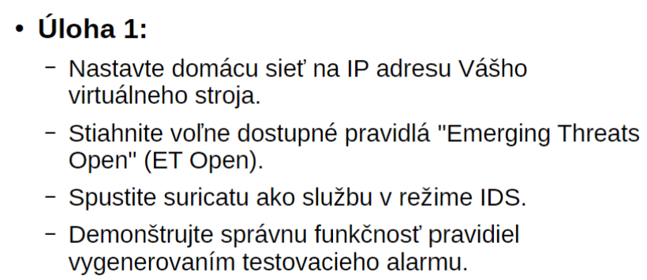
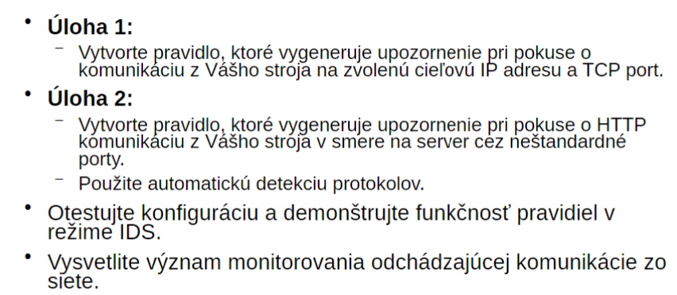
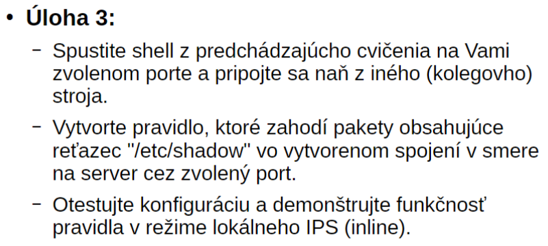

# PRBIT - Princípy bezpečnosti informačných technológií
## Report - Domáca úloha č.5
#### Autor: Marek Čederle
#### Cvičenie: Pondelok 17:00


### Použité príkazy a ich vysvetlenie
#### Zadanie č.1



Najskôr si otvoríme konfiguračný súbor Suricaty:
```bash
sudo nano /etc/suricata/suricata.yaml
```

Nastavenie domácej siete pre Suricatu, na začiatku súboru:
```yaml
vars:
  address-groups:
    # treba pridat nasledujuci riadok
    HOME_NET: "[10.103.0.0/16]"
```

Sťiahnutie pravidiel pre Suricatu:
```bash
sudo suricata-update
```

Spustenie Suricaty ako služby v režime IDS (default režim):
```bash
sudo systemctl start suricata
sudo systemctl enable suricata
```

Otvoríme si súbor s vlastnými pravidlami:
```bash
sudo nano /var/lib/suricata/rules/local.rules
```

Pridáme testovací alert:
```bash
alert ip any any -> any any (msg:"GPL ATTACK_RESPONSE id check returned root"; content:"uid=0|28|root|29|"; classtype:bad-unknown; sid:2100498; rev:7; metadata:created_at 2010_09_23, updated_at 2010_09_23;)
```

Následne sa môžeme pozrieť do logov, že tam zatiaľ nič nie je:
```bash
sudo tail /var/log/suricata/fast.log
```
Vyskúšam triggernúť mnou pridaný alert:
```bash
curl http://testmynids.org/uid/index.html
```

Následne sa pozriem zasa do logu a tam už vidím, že sa mi alert zalogoval:
```bash
10/14/2024-18:04:44.098572  [**] [1:2100498:7] GPL ATTACK_RESPONSE id check returned root [**] [Classification: Potentially Bad Traffic] [Priority: 2] {TCP} 3.165.206.97:80 -> 10.103.1.17:48352
```

Potiaľto to mi to všetko fungovalo.

#### Zadanie č.2



Pridame si do configu cestu k nášmu suboru s pravidlami:
```yaml
default-rule-path: /var/lib/suricata/rules

rule-files:
  - suricata.rules
  # pridame nasledovne pravidlo
  - /var/lib/suricata/rules/local.rules
  # alebo iba
  - local.rules
```

Otvorime si subor s pravidlami:
```bash
sudo nano /var/lib/suricata/rules/local.rules
```

Pridáme nové pravidlo:
```bash
alert tcp $HOME_NET any -> 18.239.255.112 80 (msg:"Specialny alert na 18.239.255.112 (testmyids.com) a port 80 "; sid:4000001; rev:1;)
```

Triggerneme pomocou nasledujúceho príkazu:
```bash
curl http://testmynids.org/uid/index.html
```

Pridáme ďalšie pravidlo do istého súboru:
```bash
alert http $HOME_NET any -> any !80 (msg:"HTTP na nestandardnom porte"; sid:4000002; rev:1;)
```

Už prví trigger mi nefungoval.
Testoval som to viacej krát na viacej IP adresách.
Nevedel som zistiť, prečo mi to nefunguje.
Vyskúšal som update suricaty, celého systému, reinštalovanie suricaty, reštartovanie služby, služba inak bežala bez errorov, reštartovanie stroja a nič mi nepomohlo. Nakoniec mi ani pravidlo, ktoré by sa malo vždy spustiť nedarilo triggernúť.


#### Zadanie č.3



Keďže mi to nefungovalo, tak som ani nepokračoval v riešení.

```bash

```