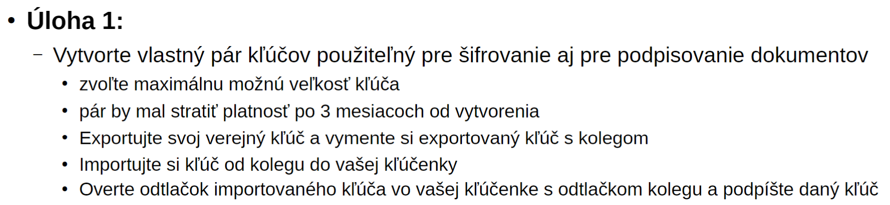
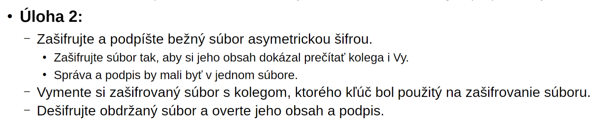
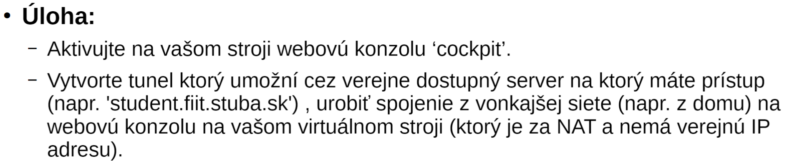
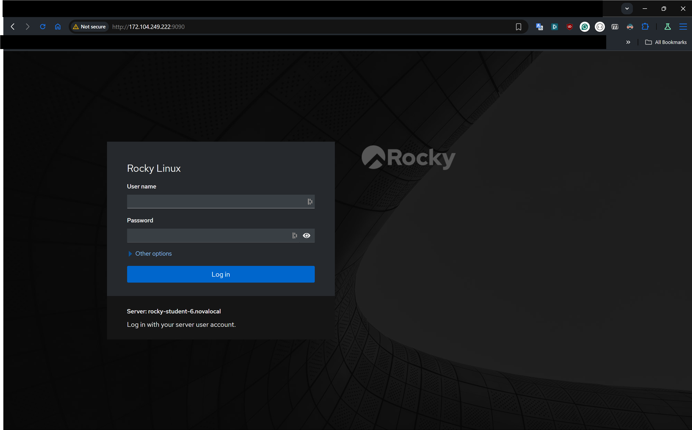

# PRBIT - Princípy bezpečnosti informačných technológií
## Report - Domáca úloha č.6
#### Autor: Marek Čederle
#### Cvičenie: Pondelok 17:00


### Použité príkazy a ich vysvetlenie
#### Zadanie č.1



Vygenerujem si nový pár kľúčov:
```bash
gpg --full-generate-key
```
- vyberiem si šifrovací algoritmus RSA a RSA (default)
- vyberiem veľkosť 4096 bitov (max)
- datum expirácie `3m`
- meno: `xcederlem`
- email: `xcederlem@stuba.sk`

Exportovanie verejného kľúča do súboru `xcederlem_gpg_key.pub`
```bash
gpg --export --armor xcederlem@stuba.sk > ~/xcederlem_gpg_key.pub
```

Vymenili sme si to s kolegom pomocou siete Discord a importovali sme si kľúče (až neskôr sme použili prenos cez netcat):

Skopíroval som si kolegov verejný kľúč do súboru `xhajkod.gpg`:
```bash
nano ~/xhajkod.gpg
```

Overíme si odtlačok kľúča:
```bash
gpg --fingerprint xhajkod
```

Kolegov fingerprint:
```
pub   rsa4096 2024-10-21 [SC] [expires: 2025-01-19]
      ABD3 E8D7 6A35 8640 88B3  C62A 3EE1 354F 924D D441
uid           [ unknown] xhajkod (kluc pre sifrovanie) <xhajkod@stuba.sk>
sub   rsa4096 2024-10-21 [E] [expires: 2025-01-19]
```

Fingerprint môjho kľúča, ktorý som poslal kolegovy aby si ho overil:
```
pub   rsa4096 2024-10-21 [SC] [expires: 2025-01-19]
      A415 96C7 1C5B 6CF6 12B6  8C9B 9DE2 7D81 3F07 3C52
uid           [ultimate] xcederlem <xcederlem@stuba.sk>
sub   rsa4096 2024-10-21 [E] [expires: 2025-01-19]
```

Kolega mi poslal jeho fingerprint a ja som si ho overil a odtlačky sedeli.
```
ABD3 E8D7 6A35 8640 88B3  C62A 3EE1 354F 924D D441
```

Podpísanie kolegovho kľúča:
```bash
gpg --sign-key xhajkod
```
- Potrvdil som podpis heslom


#### Zadanie č.2



Vytvorenie súboru `test.txt` s obsahom `Test`:
```bash
echo "Test" > test.txt
```

Zašifrovanie a podpísanie súboru `test.txt`. Aby som daný súbor prečítal aj ja, aj kolega, tak som ho zašifroval s oboma kľúčmi pričom som súbor najsôr podpísal:
```bash
gpg --sign --recipient xhajkod --recipient xcederlem --encrypt test.txt
```

Otestovavanie odšifrovania:
```bash
gpg --decrypt test.txt.gpg
```

Pomocou `netcat` si vymeníme zašifrované súbory s kolegom:
```bash
# prijatie jeho suboru
nc -l -p 1234 > xhajkod.gpg
# poslanie suboru kolegovi
cat test.txt.gpg | nc 10.103.1.14 1234
```

Odšifrovanie kolegovho súboru:
```bash
gpg --decrypt xhajkod.gpg
```
```
[rocky@rocky-student-6 ~]$ gpg --decrypt xhajkod.gpg
gpg: encrypted with rsa4096 key, ID DA34FBF74A220273, created 2024-10-21
      "xhajkod (kluc pre sifrovanie) <xhajkod@stuba.sk>"
gpg: encrypted with rsa4096 key, ID 10DCB390EACB1041, created 2024-10-21
      "xcederlem <xcederlem@stuba.sk>"
toto je test
```
Vidíme že nám to odšifrovalo správne a súbor obsahoval text `toto je test`.

U kolegu sa taktiež podarilo odšifrovať môj súbor, ktorý som mu poslal.


#### Zadanie č.3



Aktivovanie webovej konzole `cockpit` na Rocky Linuxe:
```bash
systemctl enable --now cockpit.socket
```

Spustenie reverse ssh tunelu na Rocky Linuxe:
```bash
ssh -R 9090:localhost:9090 prbit@172.104.249.222 -i ~/.ssh/key_to_linode
```
- `9090` je port na ktorom je spustený webserver a zároveň aj port, na ktorý keď sa pripojíme na vzdiaľený server, tak sa presmeruje na Rocky Linux kde je spustený webserver
- `prbit` je používateľ na vzdiaľenom serveri
- `172.104.249.222` je IP adresa vzdiaľeného servera (Linode)
- `-i ~/.ssh/key_to_linode` je cesta k súboru s privátnym kľúčom, ktorý sa použije na autentifikáciu

Keď sa pokúsim na mojom počítači pripojiť na vzdiaľený server na port `9090`, tak sa presmeruje na Rocky Linux a zobrazí sa webová konzola `cockpit`.



#### Ako funguje a aký je význam tohto presmerovania?
Funguje je to tak, že Rocky Linux si vytvorí spojenie pomocou ssh na vzdialený server (Linode) s tým, že ak príde zo vzdialeného servera komunikácia z portu 9090 tak ho Rocky linux lokálne presmeruje na port 9090 u seba. Tým pádom sa môžem pripojiť na webovú konzolu Rocky Linuxu (ktorá je tam hostovaná na localhoste) aj keď nemám priamo prístup na Rocky Linux z vonkajšej siete. Zároveň komunikácia, ktorá príde na port 9090 na vzdialený server sa automaticky posiela na port 9090 na Rocky Linux.

Význam takého presmerovania je že keď sa snaži útočník získať prístup na server, ktorý je za firewallom/NATom a nemá priamy prístup z vonkajšej siete, tak sa tam vie takto krásne dostať ak bol počítač vo vnútornej sieti infikovaný nejakým jeho malwarom. Zároveň je táto komunikácia šifrovaná čo zvyšuje bezpečnosť. Taktiež to môže byť použité dočasne na legitímne účely, keď sa administrátorovi nechce meniť konfigurácia firewallu a podobne aby prípadne mohol niečo otestovať.
