# PRBIT - Princípy bezpečnosti informačných technológií
## Report - Domáca úloha č.7
#### Autor: Marek Čederle
#### Cvičenie: Pondelok 17:00


### Použité príkazy a ich vysvetlenie
#### Zadanie č.1

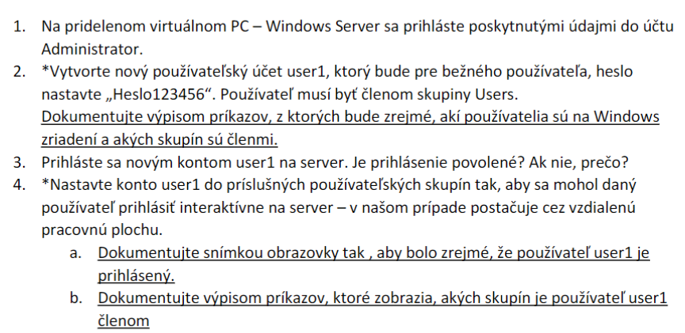

2. 
```powershell
net user user1 Heslo123456 /add
```
Do skupiny `Users` je automaticky pridaný a vieme to overiť príkazom `net users user1`.

```powershell
# PS C:\Users\Administrator> net users user1
User name                    user1
Full Name
Comment
User's comment
Country/region code          000 (System Default)
Account active               Yes
Account expires              Never

Password last set            28. 10. 2024 17:28:19
Password expires             9. 12. 2024 17:28:19
Password changeable          28. 10. 2024 17:28:19
Password required            Yes
User may change password     Yes

Workstations allowed         All
Logon script
User profile
Home directory
Last logon                   Never

Logon hours allowed          All

Local Group Memberships      *Users
Global Group memberships     *None
The command completed successfully.
```
Všetkých užívateľov môžeme zobraziť príkazom `net users`.

```powershell
User accounts for \\WIN-STUDENT-6

-------------------------------------------------------------------------------
Admin                    Administrator            cloudbase-init
DefaultAccount           Guest                    user1
WDAGUtilityAccount
The command completed successfully.
```

Ak chceme zistiť skupinu každeého používateľa, vieme použiť príkaz, ktorý bol spomenutý vyššie ale nahradíme `user1` za iné používateľské meno.

3. 
Nie, pretože na to nemá oprávnenie.

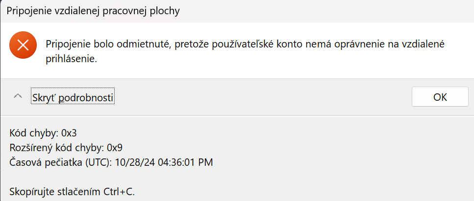

4. 
Keď sa prihlásime znova ako administrátor, môžeme pridať používateľa do skupiny `Remote Desktop Users` príkazom:
```powershell
net localgroup "Remote Desktop Users" user1 /add
```
- a)

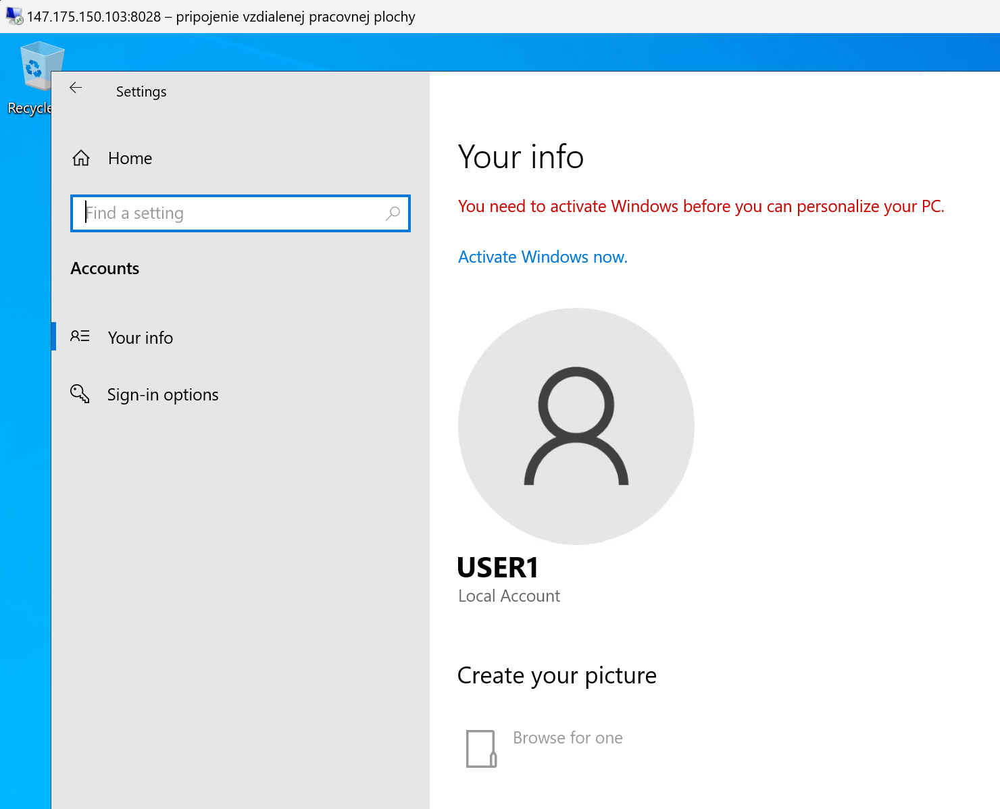

- b)

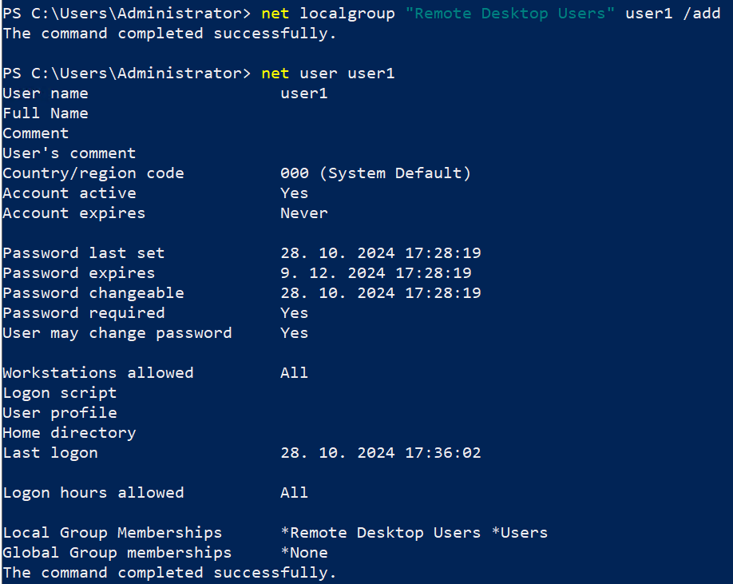

#### Zadanie č.2

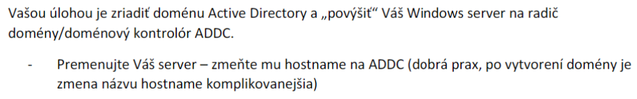

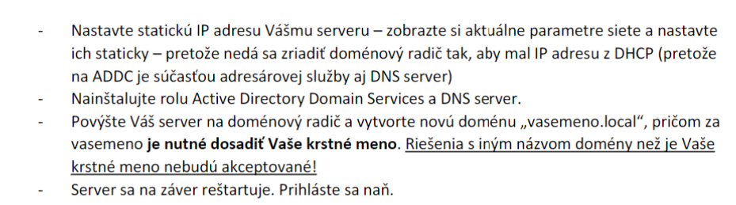

- Zmena mena na ADDC

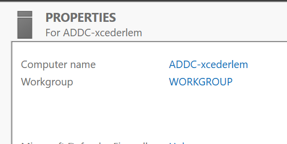

- Nastavenie statickej IP adresy

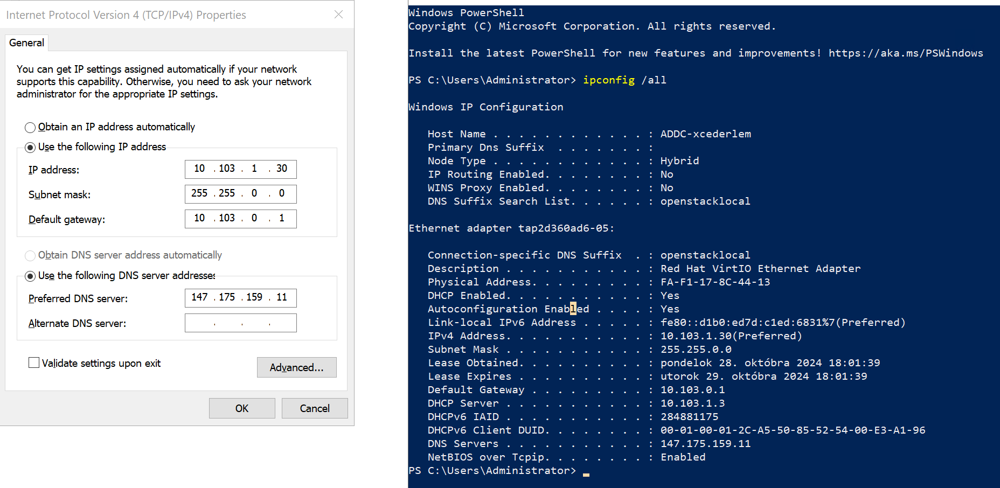

- Nainštalovanie Active Directory a DNS servera

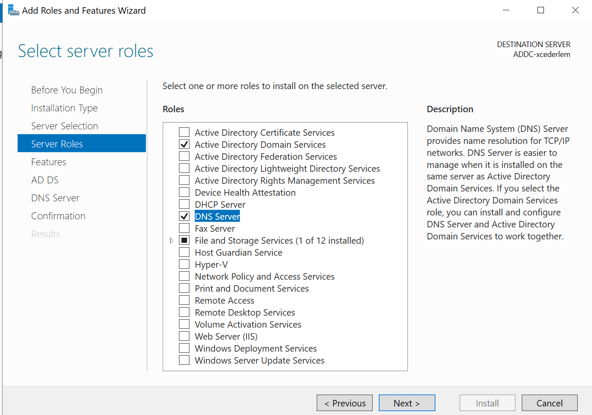

- Úspešne nainštalovaný DNS a AD radič

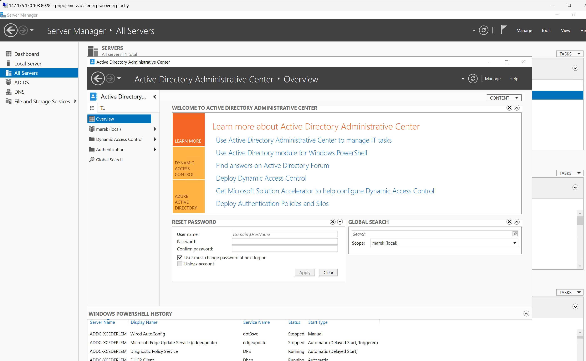

#### Zadanie č.3

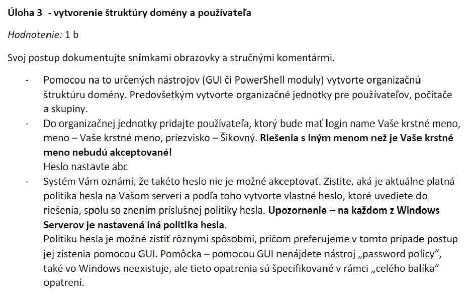

- Organizačné jednotky `Users` a `Computers` boli už vytvorené, takže som vytvoril už iba OU `Groups`.

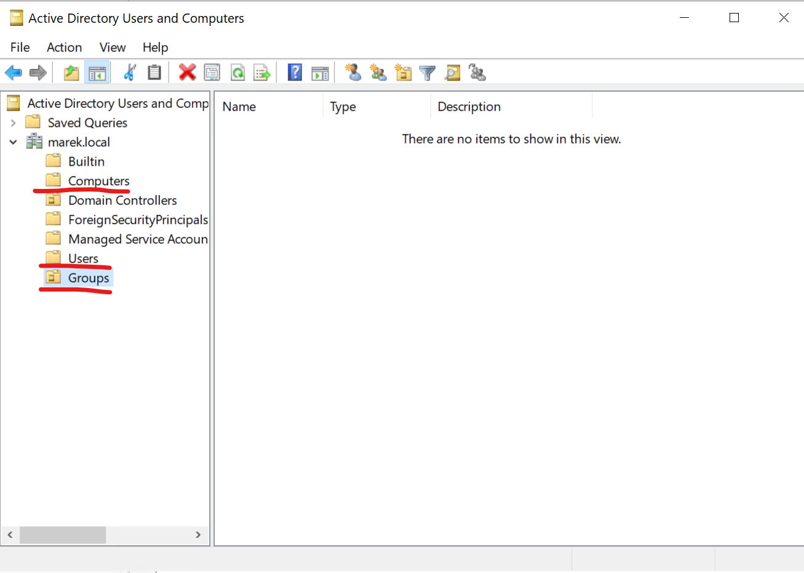

- Vytvorenie používateľa

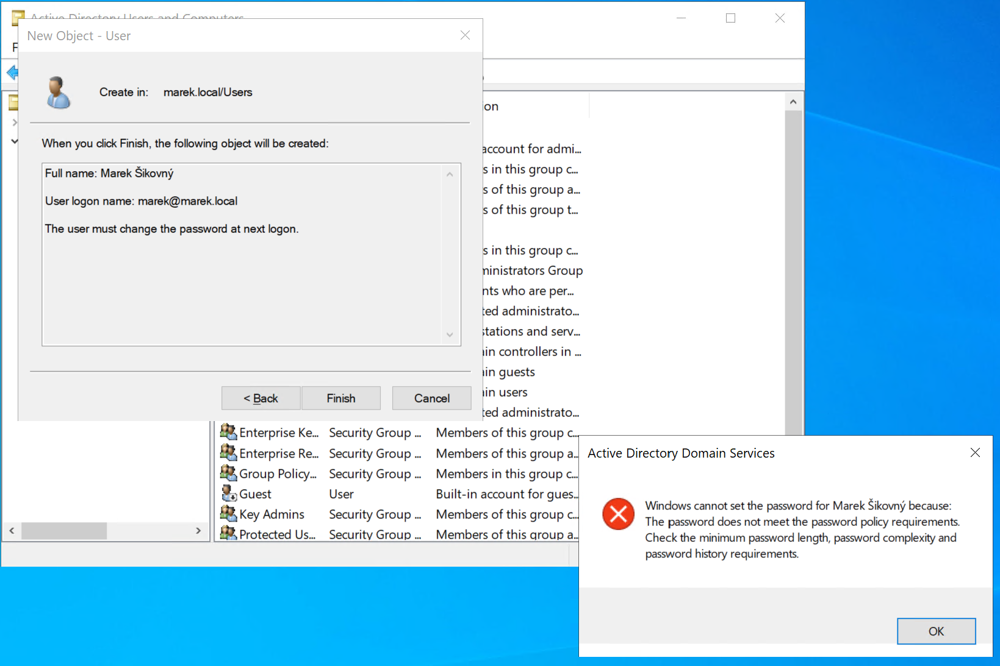

- Zistenie politík pre tvorbu hesla

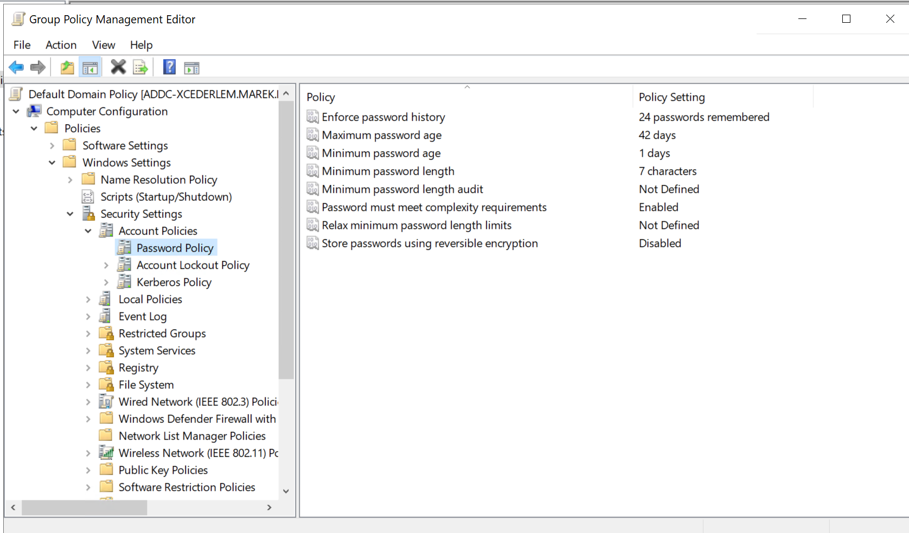

- Heslo: `Xcederlem123*`
Toto heslo spĺňa všetky požiadavky, ktoré sú nastavené v politike pre heslá.

#### Bonusové zadanie

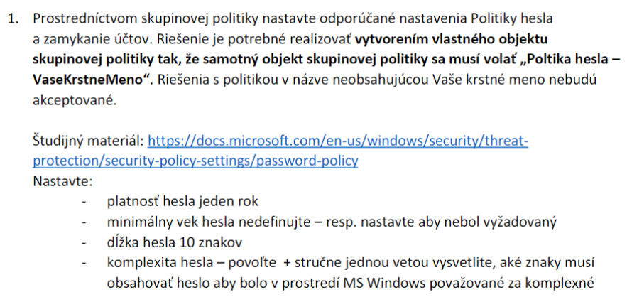

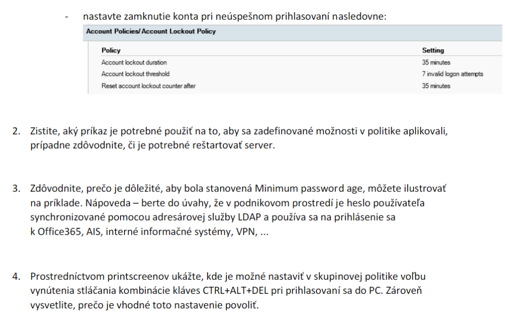


1.

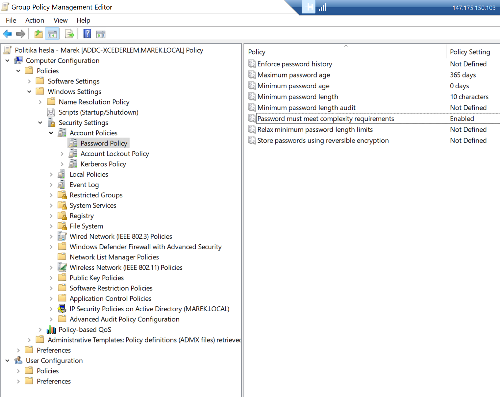

Komplexné heslo musí spĺňať nasledujúce požiadavky:
- nesmie obsahovať meno používateľa alebo časti celého mena používateľa, ktoré presahujú dva po sebe idúce znaky
- mať dĺžku aspoň 6 znakov
- obsahovať znaky aspoň z troch z nasledujúcich štyroch kategórií:
- veľké anglické znaky (A až Z)
- a nglické malé písmená (a až z)
- číslice (0 až 9)
- nealfabetické znaky (napríklad !, $, #, %) (špeciálne znaky)

Nastavenie pre zamknutie účtu:

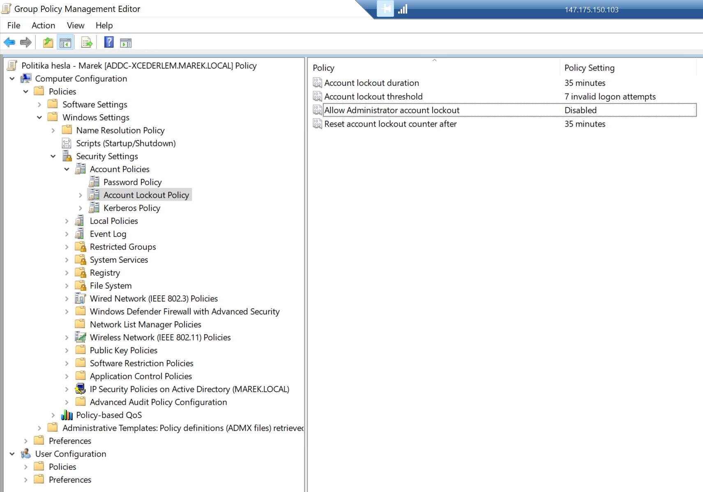

2.
```powershell
gpupdate /force
```
Príkaz spustí vynútenú aktualizáciu politík skupiny a aplikuje všetky politiky bez čakania na ďalšie plánované obnovenie.

V tomto prípade nie je treba reštartovať server, ale ak nám toto zlyhá z nejakého dôvodu (napr. nedostatočné oprávnenia a pod.), tak je vhodné reštartovať server.

3.
Bez `Minimal password age` by používatelia mohli rýchlo zmeniť svoje heslo niekoľkokrát za sebou, aby sa vrátili k pôvodnému heslu. Napríklad, ak je politika hesla nastavená tak, že heslo môže byť rovnaké až po 5 zmenách (t.z. pamätá si históriu hesiel), bez tejto politiky by používateľ by mohol zmeniť heslo 5-krát za sebou a vrátiť sa k pôvodnému heslu, čím by vedel obísť tieto bezpečnostné opatrenia.
Ďalším dôvodom je, že v podnikovom prostredí, kde sa heslá nejako synchronizujú a používajú sa na prihlásenie do rôznych systémov, tak je dôležité, aby heslá zostali konzistentné po nejakú určitú dobu pretože by mohlo dôjsť ku nejakým problémom, že niekde by bolo heslo zmenené a niekde nie a nevedel by sa používateľ prihlásiť na danú službu.

4.

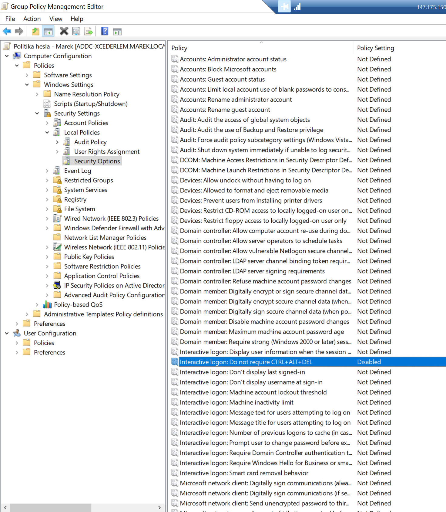

Skratka `CTRL+ALT+DEL` je kombinácia kláves, ktorá je určená pre systém a iba ten ju vie zachytiť. To znamená, že v prípade ak by na našom počítači bol nejaký malware, tak by nemohol zachytiť túto kombináciu klávesov (napr. nejaká phishing obrazovka, ktorá by sa tvárila ako daná obrazovka na zadávanie hesla), čo pre používateľa vzbuduje dôveru v daný systém a tvorí bezpečné prostredie.
